## 前言

这是书`<<类型和程序设计语言>>`的笔记和科普, 也加了一点自己的理解.

可能有错, 欢迎指正.

发布方式:[Attribution 4.0 International (CC BY 4.0)](https://creativecommons.org/licenses/by/4.0/deed.zh).

作者:[白羊](mailto:2451759073@qq.com).

仅供交流学习, 若侵犯到您的权益烦请告知, 我会立即删除.

# 类型和程序设计语言

## 语义

语义规则有三种, `操作语义`, `指称语义`和`公理语义`, 这里我们使用`操作语义`.

操作语义认为程序是表达式间的转换.

最简单的形式分为`语法`和`规则`两部分.

*   语法描述怎样形式的表达式是合法的.

*   规则描述表达式如何转换为另一个表达式.

语法的基础组成单位是项和值

*   项描述所有可能的表达式形式.

*   值描述程序所有的可能的结果.

*   显然值是项的子集.

## 布尔语言

例如考虑一个最简单的语言:

### 定义

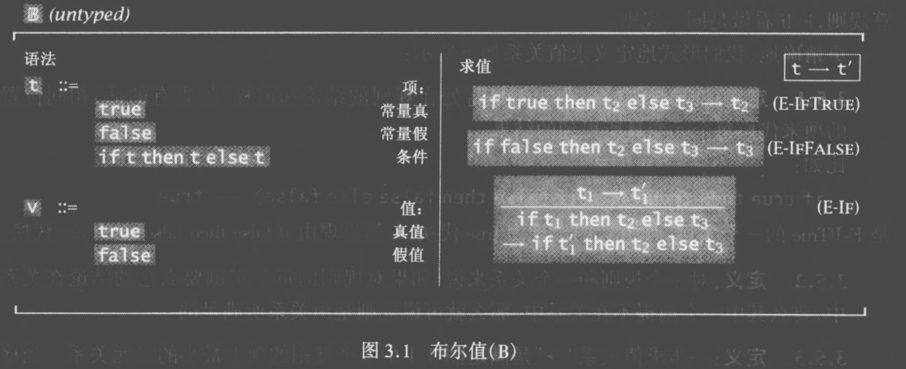

#### 语法

语法部分意味着定义两个集合`t`和`v`.

集合`t`表示所有可能的表达式形式, 集合`v`表示程序所有可能的结果.

注意它们可以包括自指的引用, 例如其中`if t then t else t`中的`t`表示的就是任何一个属于`t`集合的元素.

我们称`t`为`项`, `v`为`值`.

#### 求值规则

求值部分, 第一条的意思是, 如果看到`if true then t2 else t3`形式的表达式(其中`t2`和`t3`是`t`集合的元素), 就可以把他替换为`t2`. 第二条类似.

第三条的意思是, 如果已知`t1`可以被转换为`t1'`(其中`t1`和`t1'`是`t`集合的元素), 则`if t1 then t2 else t3`可以被转换为`if t1' then t2 else t3`(其中`t1`, `t1'`, `t2`和`t3`是`t`集合的元素).

### 计算示例

看一些表达式的计算过程:

*   `true`:

    *   无法对它进行转换, 但同时注意到它属于集合`v`, 也就是说它是一个值, 就是最终结果.

*   `if ture then false else true`:

    *   由规则1, 可以将它转换为`false`.

    *   现在得到了一个值, 这就是最终计算结果.

*   `if (if false then false else true) then true else false`:

    *   由规则2, 可知`(if false then false else true)`可转换为`true`.

        *   因此, 由规则3, 可知`if (if false then false else true) then true else false`可转换为`if true then true else false`.

    *   由规则1可知`if true then true else false`可转换为`true`.

    *   现在得到了一个值, 这就是最终计算结果.

*   `if true then true`

    *   这不是一个合法的项.

## λ演算

这样可以定义出λ演算:

### 定义

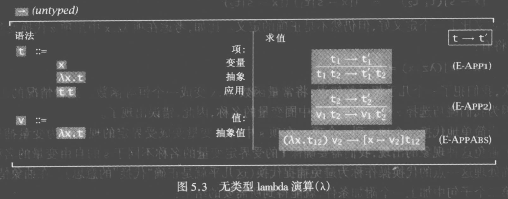

*   语法中出现的`x`不是一个特定符号, 而是任意的符号.

*   求值规则中的`[x→v2]t12`的意思是将`t12`里合适的`x`都替换为`v2`所形成的项.

> 📌这里有一个微妙的问题, 在复杂情况下可能出现重名.
>
> 例如表达式: `λx.((x)(λx.x)(y))`, 这首先是形式2, 其中的t是`(x)(λx.x)(y)`.
>
> 这个`(x)(λx.x)(y)`又是两个形式3的组合, 也就是`(x)(λx.x)`是一个形式3, 同时它也是t, 然后还是形式3, t可以和另一个t组合, 于是有了`((x)(λx.x))(y)`, 括号操作是左结合的, 所以可以简写为`(x)(λx.x)(y)`甚至`x(λx.x)(y)`.
>
> 现在考虑用它构造一个形式3: `(λx.( (x)(λx.x)(y) ))(z)`, 按规则3, 应该得到:&#x20;
>
> `[x→z](λx.( (x)(λx.x)(y) ))`
>
> 但需要注意, 这个式中的绑定关系:
>
> 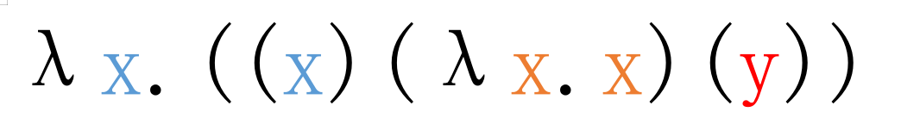
>
> 我们代换的是蓝色的x而不是橘色的x, 所以答案是`z(λx.x)(y)`.
>
> 对于程序员来说这应该不难理解, 就是参数的作用域, 上面的例子用js写:
>
> `(x=>x(x=>x)(y))(z)`
>
> 这里涉及到几个概念:
>
> 对于形式2, 有`λx.t`, 此时, 对于出现在`t`中的`x`, 我们称它被`绑定器λx`所`绑定`.
>
> 如果一个表达式有多个绑定器, 变量会绑定离他最近的那个, 在上面我们已经看到例子了.
>
> 另外, 对于某个变量, 如果它被绑定了, 我们称它为`有界`的, 否则称它为`自由`的.
>
> 例如上面例子里的`y`就是自由的.

### 计算示例

尝试用λ演算表示自然数体系: (顺便一说这叫`丘奇数`, 这种用编码表达数据的方式称为`丘奇编码`)

*   定义0为`λs.λz.z`.

*   定义1为`λs.λz.s(z)`.

*   定义2为`λs.λz.s(s(z))`.

*   以此类推

可以定义后继数函数: `SUCC=λn.λs.λz.s((n)(s)(z)))`.

*   计算0的后继数:

    *   `SUCC(λs.λz.z)`也就是`(λn.λs.λz.s((n)(s)(z)))) (λs.λz.z)`

    *   由规则3, 上式可以转换为`λs.λz.s( (λs.λz.z) (s) (z) )`.

    *   由规则3, 可知`(λs.λz.z)(s)`可转换为`(λz.z)`.

        *   因此, 由规则1, `(λs.λz.z)(s)(z)`可转换为`(λz.z)(z)`.

        *   由规则3, `(λz.z)(z)`可转换为`z`, 也就是说`(λs.λz.z)(s)(z)`可转换为`z`.

            *   因此, 由规则2, `λs.λz.s( (λs.λz.z)(s)(z) )`可转换为`λs.λz.s(z))`.

    *   这正是1的定义.

可以定义加法函数: `λx.λy.y(SUCC)(x)`

*   计算1+1:

    *   `(λx.λy.y(SUCC)(x)) (λs.λz.s(z)) (λs.λz.s(z))`

    *   `(λy.y(SUCC)(λs.λz.s(z))) (λs.λz.s(z))`

    *   `(λs.λz.s(z)) (SUCC) (λs.λz.s(z))`

    *   `(λz.(SUCC)(z)) (λs.λz.s(z))`

    *   `(SUCC) (λs.λz.s(z))`

    *   我们知道`(λs.λz.s(z))`是1, 所以1的后继数就是2了.

还可以玩出很多花样, 这不是我们的重点, 就不细说了.

总之, 可以证明λ演算是图灵完全的, 也就是说任何图灵机可以做到的事, λ演算也能做到.

## 类型化的布尔语言

现在考虑加入类型, 简单起见先尝试在之前的布尔语言中加入类型机制.

新增或修改的部分都做了标记, 下同.

### 定义

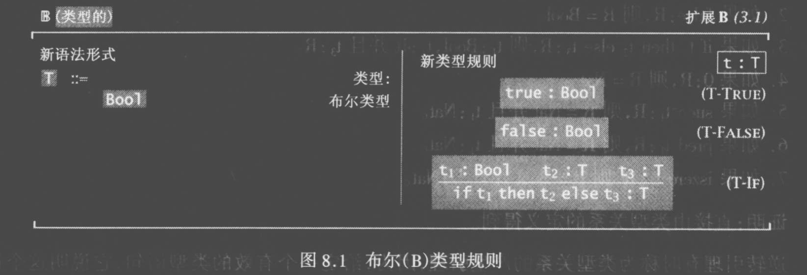

*   在语法中加入了一个新的集合`T`, 称为类型, 目前里面只有一个元素.

*   加入了一个新的区域, 称为类型规则, 描述了每个项的类型, 冒号的前面是项的描述, 后面是类型的描述.

    *   前两条不必多说, 意为`true`是`Bool`类型, `false`也是`Bool`类型.

    *   第三条是带有规则的条件, 也很容易理解.

### 安全性

在这个语言里, 任何项(也就是集合`t`的元素)都可以写出类型, 但有的语言不行.

对于一个项t, 若能写出它的类型, 则说它是`良类型`的.

类型机制要如何保证安全性呢? 有一个很重要的想法, 称为`进展保持原理`:

*   进展: 任何良类型的项不会受阻(要么它是一个值, 要么它可以转换为下一个项).

*   保持: 良类型的项转换的项也是良类型的.

构造了一个语言后, 只要能证明这两点性质, 就意味着, 只要能写出一个项的类型, 这个项就一定收敛.

这样就保证了安全.

对于我们现在设计的这个语言, 相对而言, 证明这两点还是比较容易的.

但也要一定篇幅, 我就不详细写了, 基本的想法就是分情况归纳讨论.

之后我们会看到更复杂的机制, 证明起来也非常复杂.

下面的各种类型系统也都可以证明这两条特性, 这是我们用类型系统实现安全性检查的基础.

## 简单类型λ演算

现在构造一个带类型的λ演算语言, 称为`λ→`.

要类型化λ演算, 要注意几个地方.

### 函数的类型

之前有项的形式`λx.t`, 我们知道它就是函数, 输入一个`x`, 得到一个被代换的`t`.

虽然我们可以笼统的说, `λx.t`的类型是`函数`, 但不够详细, 我们希望了解函数的参数类型和返回值类型.

于是可以将`λx.t`的类型写成`T→T`, 意为输入`T`类型, 返回`T`类型的函数.

但对于一个给定的`λx.t`形式的项, 我们要如何知道它的参数类型呢?

一个简单的方法是要求标注出来, 所以将项的形式`λx.t`改为`λx:T.t`, 意为`x`的类型是`T`.

有了这个修改后, 再考虑`λx:T.t`整体的类型. 显然, 它的类型是代换后`t`的类型.

但代换后`t`的类型取决于`x`的类型, 我们发明一个符号来表达这个关系:

`x:T1⊢t2:T2`

意为, 若已知`x`的类型是`T1`, 则可以推导出`t2`的类型是`T2`.

> 📌注意和之前规则里使用的若...则...的区别.
> `a⊢b`指的是若a成立, 则可以推导出b, 这是一个命题, 实际上它表示的是一个布尔值, 它可能为假. 也就是逻辑学中`推出`的意思.
> 而之前说的类似若`t1 → t1'`, 则`t1(t2) → t1'(t2)`的句子.
> 是指若`t1 → t1'`成立, 则`t1(t2) → t1'(t2)`也成立.
> 描述的是一种关系, 可以让你由一件事的真假来判断另一件事的真假, 也就是逻辑学中`蕴含`的意思.

那么我们可以得到规则:

*   若`x:T1⊢t2:T2`, 则`λx:T1.t2:T1→T2`.

意为:

*   如果已知`x`的类型是`T1`的前提下, 可以推导出`t2`的类型是`T2`.

*   那么`λx:T1.t2`的类型是`T1→T2`.

### 上下文

上面的方案还不够严谨.

对于`λx:T.t`而言, 要确定代换后`t`的类型, 除了要知道`x`的类型之外, 也许`t`中还包含着自由变量, 这些自由变量的类型也必须确定.

我们用符号`Г`表示这个表达式中所有变量和其类型. 我们称`Г`为上下文.

> 📌`Г`是希腊字母, 小写形式是`γ`, 读作`gamma['gæma]`.

另外定义一个逗号操作符, 可以加入新的元素到`Г`中.

没有包含任何元素的上下文是空集, 用`Г=Ø`表示.

可以在现有上下文基础上补充元素, 例如在空集基础上补充说明变量`y`的类型是`T1`, 可以写: `Г=Ø,y:T1`.

### 引入规则

所以上面的规则应该写成:

*   若`Г,x:T1⊢t2:T2`, 则`Г⊢λx:T1.t2:T1→T2`.

意为现在有一个上下文`Г`, 我们默认它里面已经包含了我们不关注的其他变量和其对应的类型.

然后我在里面补充一个变量的说明, 即`x:T1`, 意为`x`的类型是`T1`.

在这个前提下, 如果可以推导出`t2`的类型是`T2`, 那么就可以得到: `Г⊢λx:T1.t2:T1→T2`.

即在同样的上下文的前提下, `λx:T1.t2`的类型是`T1→T2`.

### 消去规则

另外还有一个规则:

若`Г⊢t1:T11→T12`, `Г⊢t2:T11`, 则`Г⊢t1(t2):T12`.

意为在给定上下文`Г`的前提下, 已知`t1`的类型是`T11→T12`, 且`t2`的类型是`T11`.

就可以知道: `t1(t2):T12`.

简单的说, 这就是已知函数`t1`, 它的类型是`T11→T12`, 然后又已知值`t2`的类型是`T11`.

所以可知`t1(t2)`, 也就是调用结果, 的类型是`T12`.

### 值类型规则

另外还有一个显而易见的规则:

若给定上下文中`Г`包含一个元素: `x:T`, 那么在这个上下文前提下, `x`的类型的`T`. 写为符号:

*   若`x:T∈Г`, 则`Г⊢x:T`.

注意这里`∈`符号的用法, 意味着`x:T`是`Г`的一个元素, 这和集合的用法一致, `Г`本来也就是集合.

### 定义

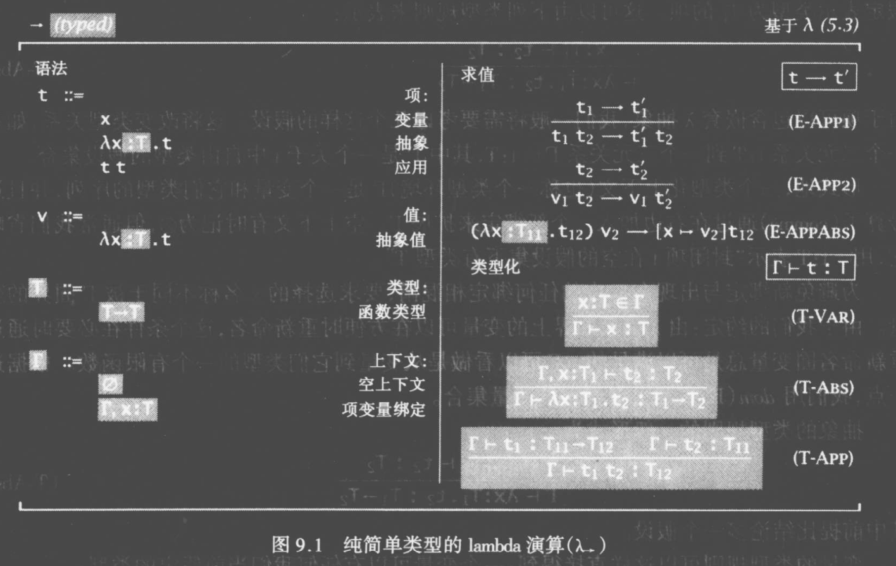

*   语法相比无类型的λ演算只是加入了类型`T`和上下文`Г`.另外将`λx.t`改成了`λx:T.t`.

*   加入的三条类型规则在上面都有分析.

> 📌现在考虑类型规则2和3.
> \- 前者描述如何`产生`一个箭头类型, 这称为`引入`.
> \- 后者描述如何`使用`一个箭头类型, 这称为`消去`.
> 对于任何一个类型, 我们都可以找到这样两条规则.
> 上面的`Bool`类型也可以找到引入和消去的规则.

## 布尔基础的有类型λ演算

简单λ演算只定义了纯演算, 忽略了其他类型演算, 但这些类型演算可以直接加入进来.

例如可以将之前的布尔语言加入进来.

不过这个需要注意的是, 要把上下文添加到原来布尔语言的类型规则里.

为完整起见, 写出全部语法, 规则和类型规则:

### 语法

*   `t` ::=

    *   `true`

    *   `false`

    *   `if t then t else t`

    *   `x`

    *   `λx:T.t`

    *   `t(t)`

*   `v` ::=

    *   `λx:T.t`

*   `T` ::=

    *   `Bool`

    *   `T→T`

*   `Г` ::=

    *   `Ø`

    *   `Г,x:T`

### 规则

1.  `if true then t2 else t3 → t2`

2.  `if false then t2 else t3 → t3`

3.  若`t1→t1'`, 则`if t1 then t2 else t3 → if t1' then t2 else t3`

4.  若`t1 → t1'`, 则`t1(t2) → t1'(t2)`.

5.  若`t2 → t2'`, 则`v1(t2) → v1(t2')`.

6.  `(λx:T1.t12)(v2) → [x→v2]t12`.

### 类型规则

1.  `Г⊢true:Bool`

2.  `Г⊢false:Bool`

3.  若`Г⊢t1:Bool`, `Г⊢t2:T`, `Г⊢t3:T`, 则 `Г⊢(if t1 then t2 else t3):T`

4.  若`x:T∈Г`, 则`Г⊢x:T`.

5.  若`Г,x:T1⊢t2:T2`, 则`Г⊢λx:T1.t2:T1→T2`.

6.  若`Г⊢t1:T11→T12`, `Г⊢t2:T11`, 则`Г⊢t1(t2):T12`.

### 类型计算

现在可以试试类型计算了, 比如试试计算`(λx:Bool.x)(true)`在上下文为`Ø`时的类型:

*   `(λx:Bool.x)(true)`

    *   显然, `x:Bool∈x:Bool`, 所以由类型规则4可知`Ø⊢x:Bool`.

    *   显然, `Ø,x:Bool⊢λx:Bool.x:Bool`

    *   因为已知以上两点, 所以由类型规则5可知`Ø⊢λx:Bool.x:Bool→Bool`

    *   由类型规则1可知, `Ø⊢true:Bool`

    *   因为已知以上两点, 所以由类型规则6可知`Ø⊢(λx:Bool.x)(true):Bool`

### 柯里-霍华德对应

在直觉逻辑中, 不使用排中律.

考虑命题: `Q为真 或 非Q为真`.

*   在经典逻辑里, 我们认为这个命题是真的, 因为`Q`要么为真, 要么`非Q`为真.

*   在直觉逻辑中, 则必须提供`Q`为真或`非Q`为真证明.

所以在直觉逻辑中, 一个命题`P`的证明只能由`P成立`的证据组成, 提出`非P不成立`的证据是没用的.

这种必须明确提供证据的方式可以看作计算过程.

考虑逻辑学中的`P=>Q`, 意为若`P`成立则可以知道`Q`也成立.

这可以理解为, 给定一个`P`的证明, 构造一个依赖于此的`Q`的证明.

现在考虑一个问题, 称为`类型居留问题`: 给定一个类型, 能否写出该类型的项?

现在给定一个类型: `Bool`:

*   你可以写出一个值: `true`, 你就证明了`Bool`类型有值居留.

已知`Bool`类型有值居留, 现在给定一个类型: `String`:

*   在逻辑学中, 已知`P`, 又已知`P=>Q`, 那么就可以证明`Q`.

*   这里也是一样, 上面我们已经提供了`P`的证明, 即`Bool`类型有值居留.

*   若你可以提供一个`Bool→String`类型的值, 那你就依赖`P`构建了一个`P=>Q`的证明.

*   所以你可以得到`Q`成立, 也就是`String`有值居留.

*   注意到`Bool→String`(函数)对应于`P=>Q`(蕴含), `Bool`和`String`(类型)对应于`P`和`Q`(命题).

在更复杂的类型系统中, 引入了更多的特性, 例如量词, 泛型, 和类型, 积类型, 子类型等, 都可以在逻辑学中找到合适的对应.

## 子类型

现在尝试在λ演算中引入子类型机制, 形成的语言称为`λ<:`.

子类型的基本想法是, 若`S`是`T`的子类型, 则所有使用`T`类型的值的地方都可以代换为`S`类型的值.

记为`S<:T`.

可以把类型理解为集合, 值就是集合内的元素. 那么`S`是`T`的子类型, 就可以看作`S`是`T`的子集.

### 关系

子类型是两个类型之间的一种关系, 所以先找到一些性质:

*   自反性: `S<:S`, 也就是自己是自己的子类型.

*   传递性: 若`S<:U`, `U<:T`, 则`S<:T`.

### 函数子类型

现已知`T1<:S1`, `S2<:T2`. 也就是`T1`是`S1`的子类型, `S2`是`T2`的子类型.

也就是`S1`比`T1`大, `T2`比`S2`大, 从符号上也可以看出来.

所谓的大小, 更好的说法是`包含特性的多少.`

例如`数字`是大的, `有理数`是小的, 因为有理数中有数字没有的特性.

比如一个有理数一定可以计算出其分子和分母, 但对一个数字而言则不一定.

谁拥有的特性越多, 谁就越特别, 就越小.

*   考虑函数`S1→S2`.

*   参数`S1`可以被替换为`T1`, 因为`T1`是`S1`的一部分, `S1`的特性`T1`都有.

    *   例如, `S1`是数字, `T1`是整数, 能处理数字的函数也能处理整数, 反之却不行.

*   返回值`S2`可以被替换为`T2`, 因为`S2`是`T2`的一部分.

    *   例如, `S2`是整数, `T2`是数字, 整数可以看作数字, 反之却不行.

*   综上, 就可以认为`S1→S2`是`T1→T2`的子类型, 任何`S1→S2`能处理的值, `T1→T2`都能处理.

*   在箭头左边, `T1<:S1`, 然后`S1`可以被替换为`T1`, 他们顺序相反, 这称为`逆变`.

*   在箭头右边, `S2<:T2`, 然后`S2`可以被替换为`T2`, 他们顺序相同, 这称为`协变`.

### 定义

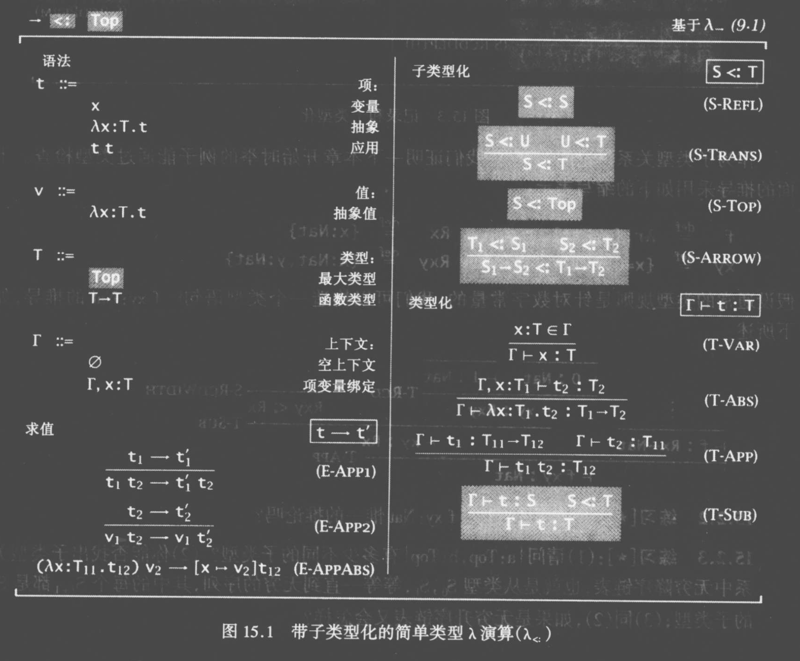

*   为了方便后续处理, 我们加入了一个最大的类型, 称为`Top`, 对任何类型`T`都有`Top<:T`.

### 实现

另外, 这里出现了一些实现上的问题, 例如类型规则7, 它可以应用于任何项.

再例如类型规则5出现了类型`U`, 但类型`U`没有出现在结果里, 这样类型`U`的选择就有无数种.

为了解决这种问题, 就需要引入一些技术手段, 详情略.

## 系统F

现在有一个更有趣的扩充, 将参数化多态性引入到简单类型λ演算中, 称为`多态λ演算`或`系统F`.

### 多态

多态的意思是一段程序段在不同的上下文里其类型不同, 而在此之上又做了一些扩充, 形成了不同的多态.

#### 参数化多态

允许一段代码使用`类型变量`来表达类型, 在实际调用的时候再决定类型变量具体是什么.

一个常见的用例是函数的泛型.

这里要说的`系统F`是最强的参数化多态方案, 一般语言里常用更简单的`let多态`方案.

#### 权宜多态

允许多态值遇到不同变量时有不同的操作, 一个常见的用例是函数的重载.

#### 加强多态

对权宜多态的加强, 允许运行时对类型进行计算, 常见的用例是反射和`instanceof`测试之类的.

#### 子类型多态

上面讨论过的子类型也是一种多态, 通过给一个项不同的类型, 来擦除其中的一些特性.

比如描述一个整数项是数, 当然这是合理的, 但这个项就只拥有了数的特性, 而擦除了整数的特性.

#### 实现

这些多态并不是相互独立的, 一个语言可以实现一种或几种多态.

这个词也有很多歧义.

*   一般函数式编程说的多态是参数化多态.

*   面向对象说的多态一般指子类型多态, 而将参数化多态称为泛型.

### 类型变量

参数化多态希望类型也成为参数, 在调用的时候先输入一个类型, 将其实例化为项.

于是引入一个新的语法: `λX.t`, 注意`X`是大写, 表示这个是一个参数而不是一个项.

而把类型应用到这种项上的语法写为: `t[T]`.

接下来加入求值规则: `(λX.t12)[T2]→[X→T2]t12`.

意为对`(λX.t12)`应用类型`T2`时得到的结果是, 将项`t12`中的合适的类型变量`X`全替换为`T2`.

例如, 考虑项: `(λX.λx:X.x)`, 可以先应用一个类型上去: `(λX.λx:X.x)[Bool]`, 可以得到`(λx:Bool.x)`.

最后还要对`λX.t`的项给出一个类型写法.

例如上面的`(λX.λx:X.x)`, 它的类型是`∀X.X→X`, 表示`X`是一个类型变量, 输入`X`后, 得到`X→X`的函数.

另外, 类似于λ演算, 类型变量也存在绑定问题和自由变量问题, 所以这里上下文中也放入了类型变量.

最后要说明的是, 类似简单类型λ演算, 这里说的系统F也忽略了其他类型演算, 在需要的时候可以直接加入.

### 定义

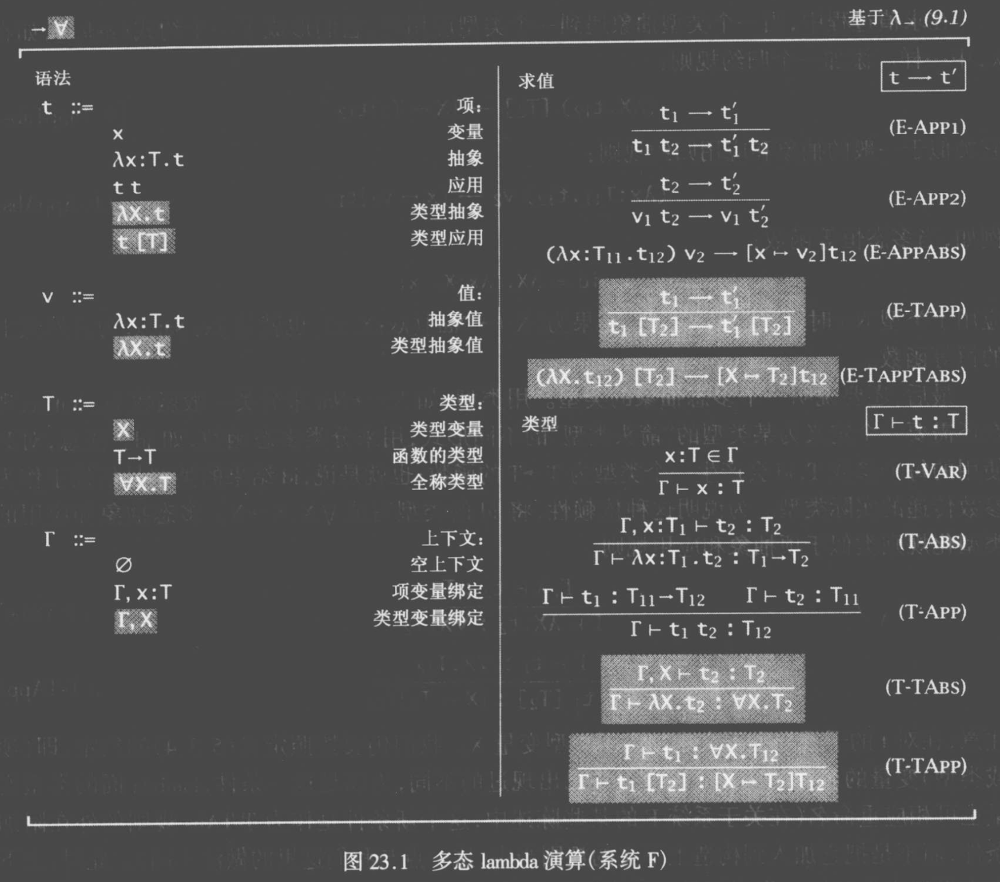

### 不可确定性

虽然系统F很强大, 但可以证明, 系统F的类型重构(推断出项的类型)问题是无法确定的.

就是说类型推导算法无法针对任意系统F代码运行, 一定有代码无法使用算法推导其类型.

有一些局部和贪心算法可以作为次优解.

细节这里就不说了.

### 前束多态

考虑这个两个表达式:

*   `∀X.X→X→Bool→Bool`

*   `Bool→(∀X.X→X)→Bool`

区别在于绑定器`∀X`的作用域, 式1的`∀X`绑定类型变量`X`的范围是式子整体, 式2绑定的类型变量`X`的范围却是后面的一小块函数.

粗略的说, 如果限制绑定器范围必须是式子整体, 那么就称为`let多态`, 也叫`前束多态`.

另外上面的式子2成为`2秩多态`, 具体规则就不说了, 以此类推还有更高秩以及一般的`N秩多态`.

可以证明3秩及以上多态的类型重构问题都是不可确定的.

而`let多态`和`2秩多态`的类型重构问题并不是无法确定的, 所以实际语言里实现的通常是它们.

尤其是`let多态`, 因为简单, 容易理解, 推导算法也简单, 很多常见的语言都实现的是它.

## 存在类型

可以在系统F的基础上加入存在量词.

### 类比

上面说的全称类型有两种理解方式:

*   首先先理解前提: 类型实际上是集合, 所以`∀X.T`实际上是某种集合.

*   逻辑的: `∀X.T`的元素是项, 他们都满足: 对任意的类型`S`而言, 这些项的类型都是`[X->S]T`.

*   操作的: `∀X.T`的元素是函数, 他们都满足: 输入一个类型`S`, 得到一个项, 这个项的类型是`[X->S]T`.

类比则可以理解存在类型:

*   逻辑的: `∃X.T`的元素是项, 对某类型`S`而言, 这些项的类型都是`[X->S]T`.

*   操作的: `∃X.T`的元素是二元组`{S, t}`, 其中`S`是某类型, `t`是项, `t`的类型为`[X->S]T`.

    *   我们在这里将`∃X.T`写成`{∃X,T}`的形式来强调这一点.

例如, 考虑二元组`p={Bool, {a=true,b:λX:Bool.Bool→Bool}}`, 我们说它的类型是`{∃X,{a:X,f:X→X}}`.

这里`p`的`S`是`Bool`, `t`是一个字典类型.

意味为对某些`X`(例如`Bool`), 可以得到类型为`{a:X,f:X→X}`的值.

> 📌为了简单, 现在我们只讨论最简单也是最一般的形式, 如果有多个`X`, 可以理解为套用的形式:
> `{S1, {S2, t}}`

不过依然是对于二元组`p`, 也可以说它有类型`{∃X,{a:X,f:X→Bool}}`.

所以, 需要手动指定其存在类型, 可以这样写: `p as {∃X,{a:X,f:X→Bool}}`.

### 引入规则

现在可以写出引入规则:

*   若`Г⊢t2:[X->U]T2`, 则`Г⊢{*U, t2} as {∃X, T2}:{∃X, T2}`.

这里`*U`指`U`的子集.

*   比如有项`t2={a=true,b:λx:Bool.true}`, 我知道它的类型是`{a:Bool, b:Bool→Bool}`.

*   现在已知一个带类型变量的类型`T2={a:X,f:X→X}`, 则`t2`的类型可以写为`[X→Bool]{a:X,f:X→X}`.

*   现在则可以说, `{Bool, t2}`的类型是`{∃X, T2}`.

为什么是`*U`呢?&#x20;

因为满足`t2:[X->U]T2`的`U`是一个集合, 存在类型就是做一些限制, 只允许其中某些类型组成存在类型.

### 消去规则

接下来就可以使用存在类型了:

*   若`Г⊢t1:{∃X, T12}`, `Г,X,x:T12⊢t2:T2`, 则`Г⊢let {X,x}=t1 in t2:T2`.

基本上意思是:

*   已知一个项`t1`是存在类型`{∃X, T12}`.

*   且已知项`t2`, 若在指派`X`,`x:T12`时, `t2`是`T2`类型.

*   则可以进行一个`模式匹配`, 将`t1`中的类型和值取出来, 称为`X`和`x`, 然后应用于`t2`.

*   此时可知`t2`是`T2`类型.

例如:

*   有二元组`t1={Bool, {a=true,b:λx:Bool.true}}`的类型是`{∃X,{a:X,b:X→X}}`.

*   若又已知项`t2=λy:X.(x.b(x.a))(y)`, 在指派`X`, `x:{a:X,b:X→X}`时得到结果的类型是`T2`.

    *   可知`T2`应该是`X`.

*   现在可以进行可以模式匹配, 取出类型`{∃X,{a:X,f:X→X}}`的两部分, 称为`X`和`x`.

    *   可以知道`X`是`Bool`, `x`是`{a=true,b:λx:Bool.true}`.

*   然后将`X`和`x`应用到`t2`.

    *   此时有`{X,x} in t2=λy:Bool.((λx:Bool.true)(true))(true)=true`, 类型为`T2=X=Bool`.

*   当然, 条件必须是合理的, 不能假设`t2`是`x.a(x.b)`之类的, 必须要符合`x:{a:X,b:X→X}`的指派.

    *   有一些关于这一点的检查策略, 这里就不多说了.

### 定义

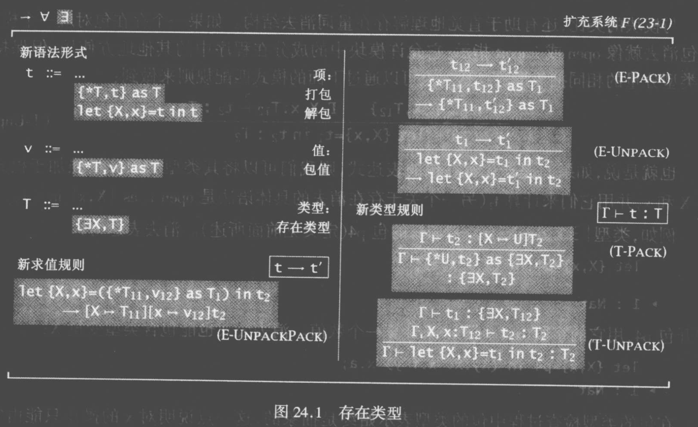

### 抽象数据类型

传统的抽象数据类型(ADT)包括:

*   抽象类型A.

*   实际类型T.

*   类型T的值的创建, 操作等实现.

*   封装类型和操作的抽象边界.

    *   边界内, 类型的元素可以看到形式T.

    *   边界外, 类型的元素只能看到抽象形式A.

    *   在边界外, 类型A的值可以被存储, 传输, 但只有在边界内, 才能解包为类型T的值进行操作.

> 📌这里的`ADT`是`Abstract_data_type`的缩写.
> 有一个同名的缩写`ADT(Algebraic data type)`是`代数数据类型`, 不要混淆它们.

例如, 考虑一个计数器:

*   抽象类型: `Counter`

*   实际类型: `Number`

*   签名:

    *   `new :: Counter`

    *   `get :: Counter→Number`

    *   `inc :: Counter→Counter`

*   操作:

    *   `new = 1`

    *   `get = λi:Number. i`

    *   `inc = λi:Number. succ(i)`

首先可以看到两个类型, 抽象类型指的是`外部`看到的数据类型, 而实际类型则是`内部`看到的数据类型.

有三个操作, 分别也对应了内外, 对外部而言, 都是对Counter的操作, 对内部而言却都是对Number的操作.

实际用的时候类似这样: `Counter.get(Counter.inc(Counter.new))`, 得到2.

这样的好处有很多.

*   限制了范围, 当要修改抽象时, 只需要修改其暴露的操作即可, 这种机制保证了外部不会依赖抽象内部的特定状态和结构, 因此可以随意的修改内部结构, 甚至整个替换掉.

*   将程序分为了小的部分, 让每个部分都独立工作, 有助于减去不必要的复杂度.

*   让使用抽象的人可以简单理解其能力而不需要知道其细节.

*   为了让抽象清晰, 要求程序员思考设计和建模的问题.

这种结构的具体实现又分为过程式, 函数式, 公理式等等, 我们常见的面向对象基本上是一种过程式实现.

#### 存在类型实现

用存在类型可以实现这样的结构:

```haskell
counterADT = {Number, {new = 1, get = λi:Number. i, inc = λi:Number. succ(i)}}
  as {∃Counter, {new: Counter, get: Counter->Number, inc: Counter->Counter}}
```

现在就可以使用了:

```haskell
let {C, c} = counterADT in c.get(c.inc(c.new))
```

解包出来的类型也可以使用, 比如创建一个函数, 然后在闭包区域内引用:

```haskell
let {C, c} = counterADT in
  let add3 = λx:C. c.inc(c.inc(c.inc(x))) in
    c.get(add3(c.new))
```

甚至还可以在闭包内创建新的类型:

```haskell
let {C, c} = counterADT in
  let {T,t} = {Counter, {new = counter.new}} as {∃T, new: T} in
    t.new
```

### 编码

就像之前用λ抽象编码数字一样, 这里可以通过系统F编码存在类型.

*   `{∃X,T}`等价于`∀Y.(∀X.T→Y)→Y`.

*   `let {X,x}=t1 in t2`等价于`t1[T2](λX.λx:T11.t2)`.

细节略.

## 多态子类型

尝试在系统F中引入子类型可以形成另一个系统, 称为`F<:`(F子).

### 囿量词

考虑这个问题:

*   现在给定一个函数: `f: {a:Number} → {a:Number}`.

*   如果引入子类型化, 我们就可以用`{a:1, b:2}`来调用它.

    *   因为`{a:Number, b:Number}`是`{a:Number}`的子类型.

*   不幸的是这样得到的结果类型是`{a:Number}`, `b`被丢弃了.

*   这时可以使用全称量词, 把`f`的类型写成`f: ∀X. X → X`.

*   这样用: `f[{a:Number, b:Number}]({a:1, b:2})`就可以推导出正确的类型`{a:Number, b:Number}`.

*   有些情况是不行的, 比如这个函数: `λx:{a:Number}. {orig=a, next=succ(a)}`.

*   如果写它的类型是`f: {a:Number} -> {orig: {a:Number}, next: Number}:`

    *   使用值`{a:Number, b:Number}`调用时.

    *   这时`orig`的类型应该是`{a:Number, b:Number}`, 但标注的类型是`{a:Number}`, `b`被丢弃了.

*   这次全称量词也没用了, 写`f=λX. λx:X. {orig=x, next=succ(x.a)}`会报错.

    *   因为你说明了`x`的类型是`X`, 但你试图访问`x.a`, 但无法确保`X`中有`a`.

*   这时候可以限定`X`的类型, 就是所谓的`囿量词`(受限的量词), 写法是:

    ```haskell
    f :: ∀X<:{a:Number}. X -> {orig:X, next:Number}
    f = λX<:{a:Number}. λx:X. {orig=x, next=succ(x.a)}
    ```

### 定义

有两种定义方式, 称为核心F子和完全F子.

核心F子更容易处理, 但不太灵活.

完全F子表达能力更强但在类型重构上是不可确定的.

### 核心F子

基本上核心F子只是系统F和子类型的融合:

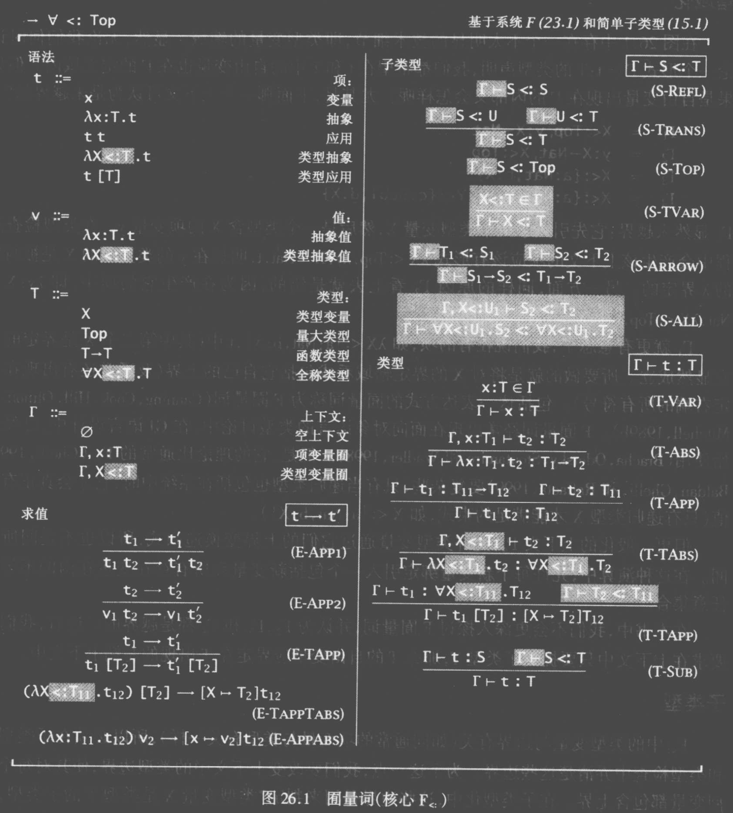

*   为了方便, 可以把`∀X:<Top.T`简写为`∀X.T`.

*   加入了规则`S-TVAR`, 用来形式化`X`的限定边界.

*   加入了规则`S-All`描述量词的项的子类型情况, 注意生成的关系中父类型和子类型的量词是一致的.

*   最后在规则`T-TAPP`中, 加入了一个前提, 表示提供的参数确实是量词约束的子类型.

### 完全F子

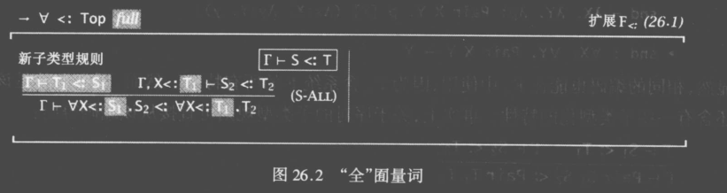

*   只是修正了`S-ALL`规则, 允许生成的关系中父类型和子类型的量词也不一致.

### 存在类型F子

除了对系统F扩充子类型, 也可以对存在类型系统扩充子类型:

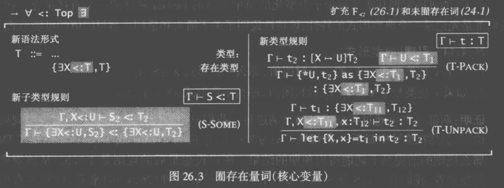

*   类似的, 关于生成的关系中量词是否一致, `S-Some`规则也有两种形式, 这里写的是核心形式.

有了这种机制后, 可以稍微扩充ADT(抽象数据类型), 还是考虑之前计数器的例子, 现在给他加上囿:

```haskell
counterADT = {Number, {new = 1, get = λi:Number. i, inc = λi:Number. succ(i)}}
  as {∃Counter <: Number, {new: Counter, get: Counter->Number, inc: Counter->Counter}}
```

这样, 在算出`Counter`时, 可以直接把他当`Number`来用, 更方便一点.

```haskell
let {C,c} = counterADT in succ(c.inc c.new)
```

而另一方面`Number`不能作为`Counter`, 依旧安全.

```haskell
let {C,c} = counterADT in c.inc 3 -- 报错
```

## 高阶类型λ演算

在简单类型λ演算中加入类型等级计算, 可以构成系统`λw`.

### 类型算子

我们可以类推出类型等级上的λ计算, 比如`λX.{a:X,b:X}`就是输入一个类型, 得到一个类型的计算.

这样的话一个类型就可以有很多种写法了, 如果令`Id=λX.X`, 那么下面两个类型就是等价的:

*   Bool

*   Id(Bool)

可以定义一种关系, 表示类型的等价逻辑:

*   `(λX::K11.T12)T2`等价于`[X→T2]T12`.

*   就像λ演算标注了参数类型一样, 这里也标注了类型X的类型, 类型的类型称为分类, 下面会说到.

以此可以构造一条推导关系:

*   若`Г⊢t:S`, 且`S与T等价`, 则`Г⊢t:T`.

### 类型的类型

类型的类型称为`分类`, 使用一个构造子`=>`来构造.

*   `Bool`, `String`, `Bool→Bool`, 的分类都是`*`.

*   `λX.X`的分类是`*=>*`.

*   类似值类型的λ演算, 也可以出现例如`(*=>*)=>*`的高阶类型算子.

*   因为`*`非常常见, 我们把`λX::*.T`简写为`λX.T`.

### 类型等级

我们把类型等级分成三层, 项, 类型, 分类.

*   项包括基本类型项, 复合类型项, 函数项, 函数调用, 类型抽象, 类型调用等.

*   类型包括Bool这种类型和类型算子.

*   分类则是按类型算子的参数个数来分的.

*   参考图:

    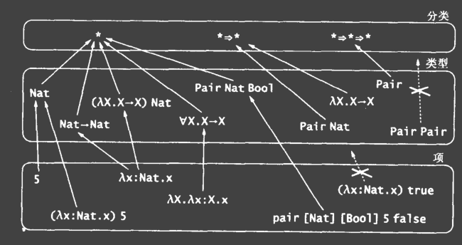

也许你会问为什么不能对分类再做分类, 构造出分类的类型呢?

其实是可以的, 分三层只是因为大多数情况下已经足够了.

> 📌在通常的编程语言中, 系统会内置一些类型算子, 比如java中的Array, 你可以给它传一个参数.
> 在haskell这样的函数式语言中, 类型算子成为了类型机制的一部分.

> 📌除了`=>`构造子, 还有其他的分类构造子, 但这里我们就不说了.

### 定义

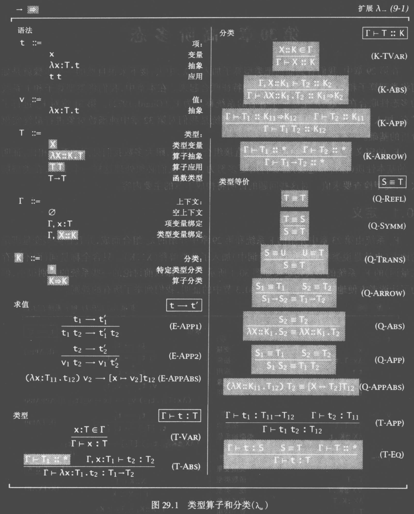

## 高阶多态

相对的, 在系统F加入类型等级的计算形成的系统称为`Fw`.

### 定义

基本上只是将系统F和上节的λw组合起来:

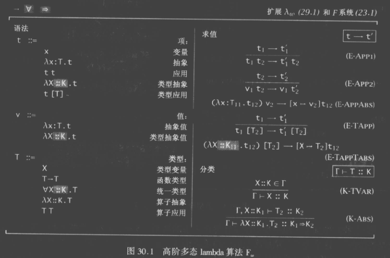

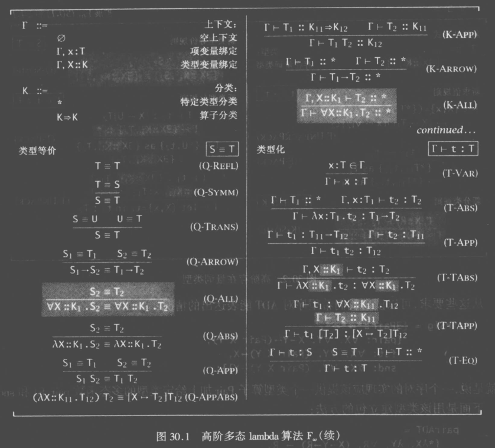

### 包含

可以看到简单λ演算和系统F是包含在`Fw`中的, 如果做一些限制, 就可以让它回退到简单形式.

定义分层:

*   `X1=Ø`

*   `X(i+1)={*}∪{J=>K | J∈Xi 且 K∈X(i+1)}`

也就是:

*   `X2={*}`.

*   `X3={*}∪{J=>K | J∈{*} 且 K∈{*}}={*, *=>*}`.

*   `X4={*}∪{J=>K | J∈{*, *=>*} 且 K∈{*}}={*, *=>*, *=>*=>*}`.

然后定义系统F片段:

*   系统`F(i+1)`允许在`X(i+1)`分层上进行类型量化, 在`Xi`分层上进行抽象.

例如:

*   系统F1不允许类型量化和类型抽象.

    *   这就是简单类型λ演算.

*   系统F2允许对最高`*`分类进行量化, 但不允许抽象..

    *   例如`∀X.T`, 其中X的分类必须是`*`.

    *   这就是系统F.

*   系统F3允许对最高`*=>*`分类进行量化, 允许抽象`*`的分类.

    *   例如`∀X.T`, 其中`X`的分类可以是`*`或`*=>*`.

    *   例如`λX::K.T`, 其中`K`的分类最高为`*`.

    *   这就是上面表格中的系统.

*   还有更高的系统统称为全Fw系统.

### 依赖类型

*   简单λ演算中, 我们将项的一部分抽出来称为参数, 在运行时确定参数.

    *   这样可以形成一组项的组合, 依据不同参数, 获得组合中不同的项.

    *   参数的类型是项.

*   在系统F中, 我们将项中的类型的一部分抽出来称为参数, 在运行时确定参数.

    *   这样也形成了一组项的组合, 依据不同参数, 获得组合中不同的项.

    *   参数的类型是类型.

*   在λw中, 我们将类型的一部分抽出来称为参数, 在运行时确定参数.

    *   这样也形成了一组类型的组合, 依据不同参数, 获得组合中不同的类型.

    *   参数的类型是类型.

还有一种可能性: 使用项做参数, 获得类型, 这称为依赖类型.

例如一个浮点数列表类型, 在依赖类型里写做`FloatList<n>`.

其中`n`表示这个列表中有多少个元素.

那么对于一个空列表而言, 它的类型是`FloatList<0>`.

对于一个添加列表值的函数, 它的类型应该是输入一个`FloatList<n>`得到一个`FloatList<n+1>`.

这其中`n`就是一个参数, 但它是一个项, 而不是一个类型. 把他写成`Π`.

那么就有:

*   `nil: FloatList 0`

*   `cons: Πn:Number. Float → FloatList n → FloatList (n+1)`

对于形如`Πx:T1.T2`的表达式而言, 其实是对`T1→T2`的一种扩充, 这允许`T2`使用`x`这个项.

当`T2`没有使用`x`时, `Πx:T1.T2`就可以退化为`T1→T2`.

不幸的是依赖类型的性质证明, 类型推导等问题更加复杂, 很多语言都在通过加入限制来使用依赖类型.

### λ立方体

以上这一切组成了所谓λ立方体:

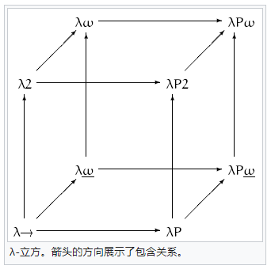

*   这个立方体包含着各种类型的包含关系.

    *   例如我们从`λ→`开始, 加入多态性得到`λ2`(系统F), 加入类型算子后得到λw(也就是我们说的`λw`).

    *   而`λ2`加入类型算子, 或`λw`加入量词, 得到图上的`λw`, 也就是我们说的`Fw`.

*   立方体向上表示加入多态性, 立方体向内表示加入类型算子, 立方体向右表示加入依赖类型.

*   最远端右边的类型`λPw`表示构造演算, 包含所有抽象形式.

*   子类型没有在图中体现出来.

## 高阶子类型

最后, 对`Fw`加入子类型机制可以得到`Fw:<`, 基本上是`Fw`和`F:<`的组合.

有多种不同想法的`Fw:<`系统, 细节上有些差别.

当然在组合的过程中也需要调和各种问题, 这里就不多说了.

### 定义

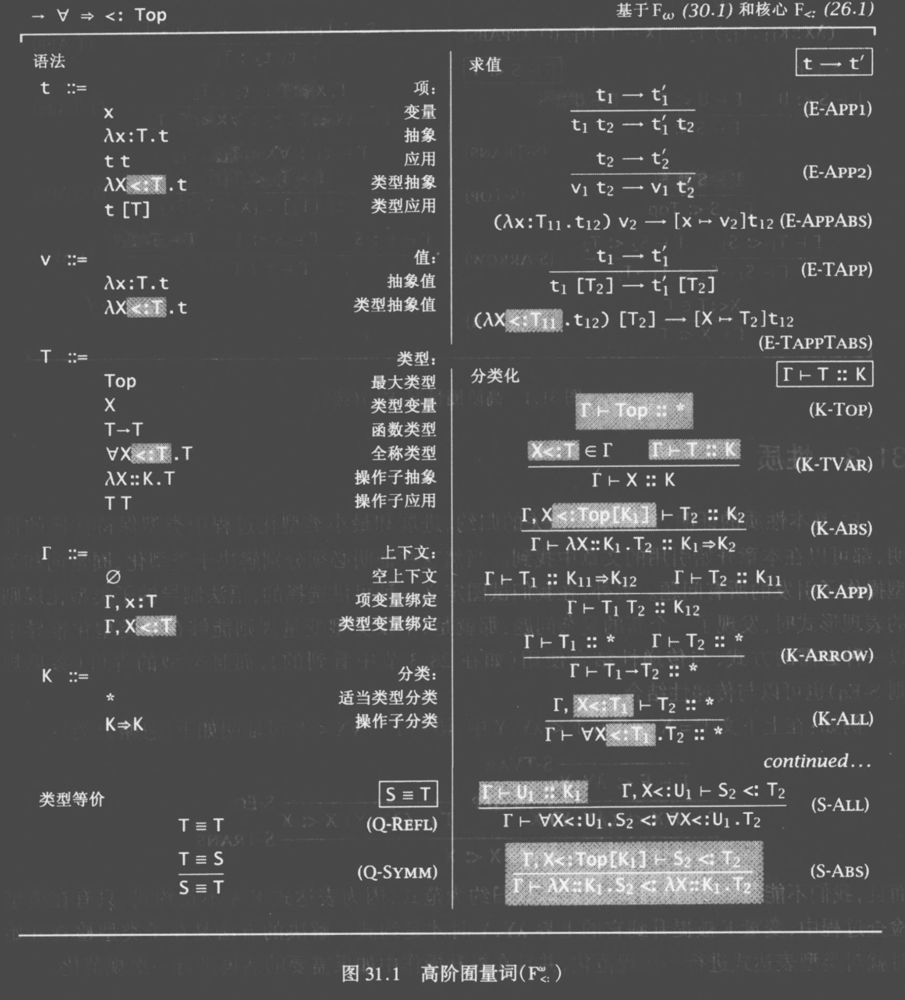

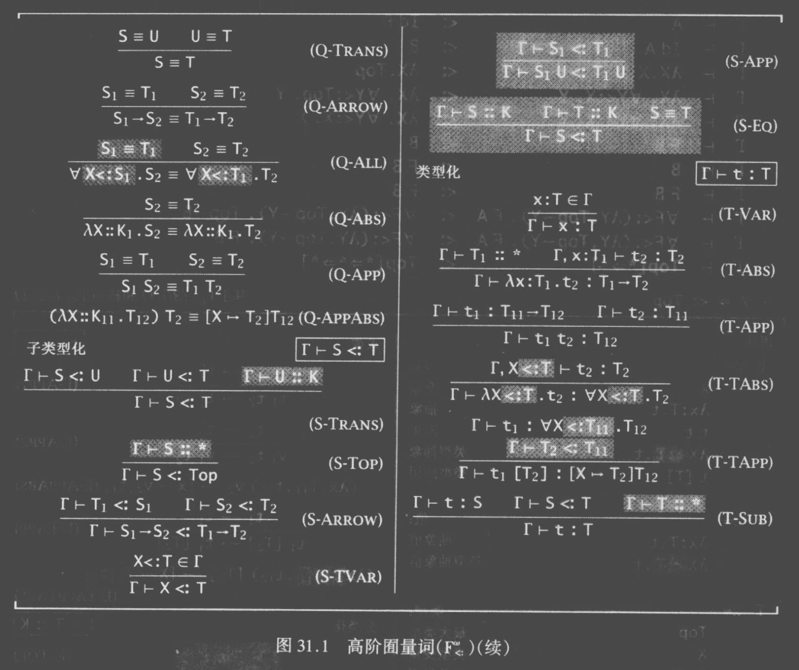
